# Game of Thrones App

Esta aplicación Android, desarrollada con Jetpack Compose, ofrece una experiencia interactiva para explorar el universo de Game of Thrones.

## Características Principales

### 1. Diseño Adaptativo
- **Vistas Responsive:**
  - Compact: Optimizada para teléfonos móviles
  - Medium: Diseñada para tablets
  - Expanded: Adaptada para pantallas grandes y desktop

### 2. Navegación
- Barra de navegación inferior con tres secciones principales:
  - Characters: Lista de personajes
  - Deaths: Registro de muertes
  - Houses: Casas de Poniente

### 3. Funcionalidades de Búsqueda
- Barra de búsqueda integrada que permite:
  - Búsqueda por nombre de personaje
  - Búsqueda por título
  - Búsqueda por casa/familia
- Historial de búsquedas recientes

### 4. Base de Datos Local
- Implementación con Room Database
- Almacenamiento de:
  - Información de personajes
  - Estado de vida/muerte
  - Historial de búsquedas

## Capturas de Pantalla

### Orientación Vertical
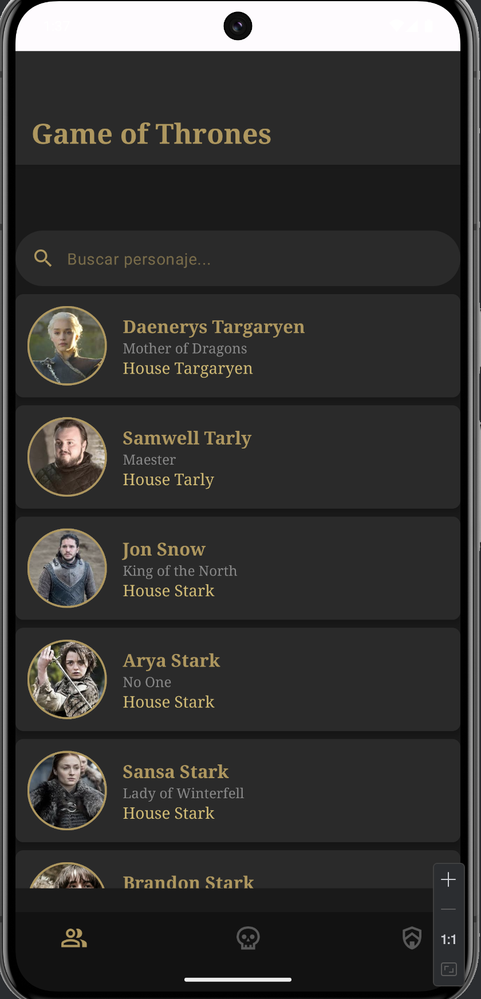 

### Orientación Horizontal

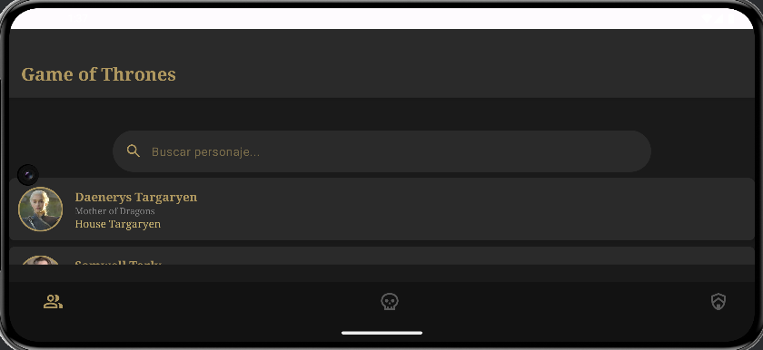

### Funcionalidad de Búsqueda
| Barra de Búsqueda | Resultados |
|-------------------|------------|
| 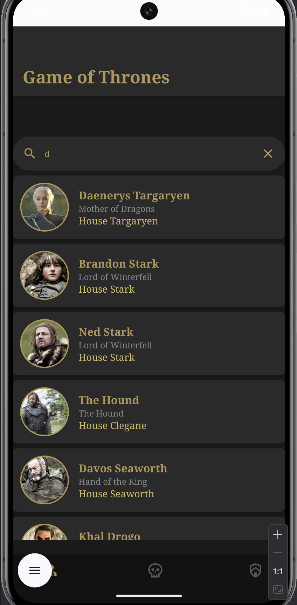 | 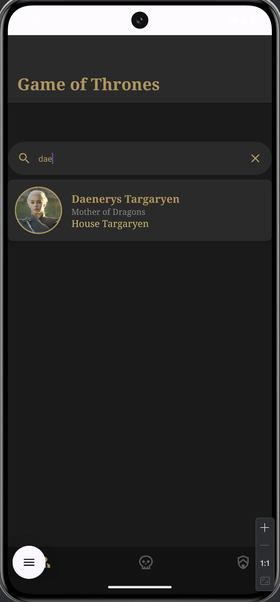 |

### Sistema de Muertes
| Sin Muertes | Con Muertes | Personaje Vivo |  Personaje Muerto |
|-------------|-------------|-------------------|---------------------|
| 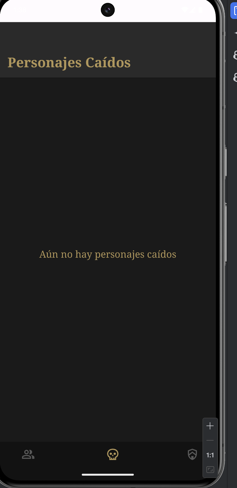 | 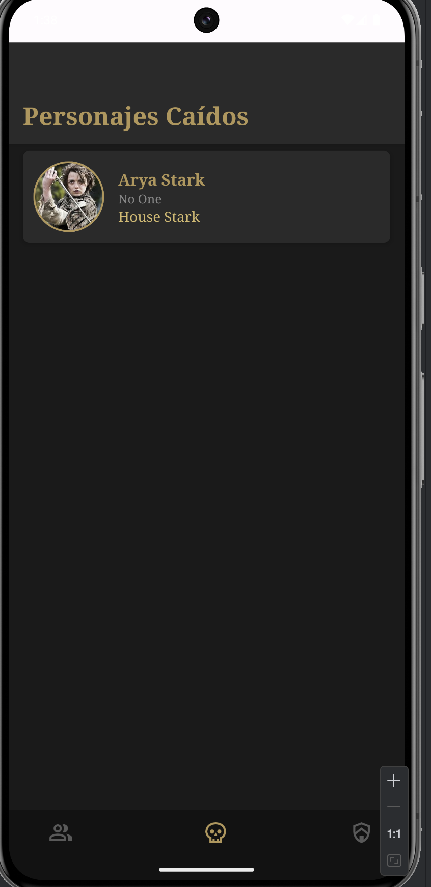 | 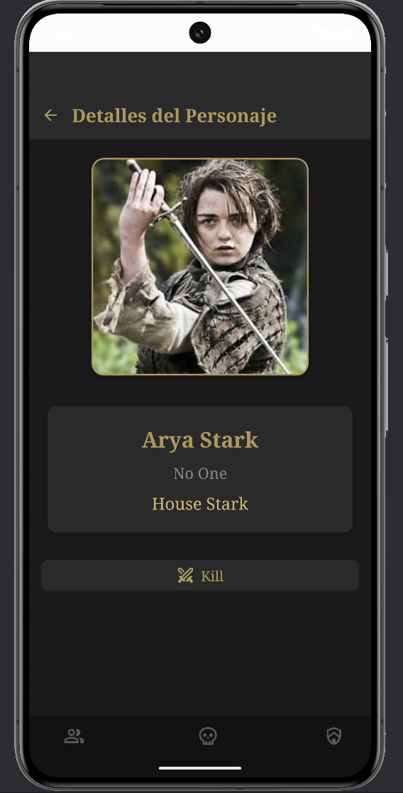 | 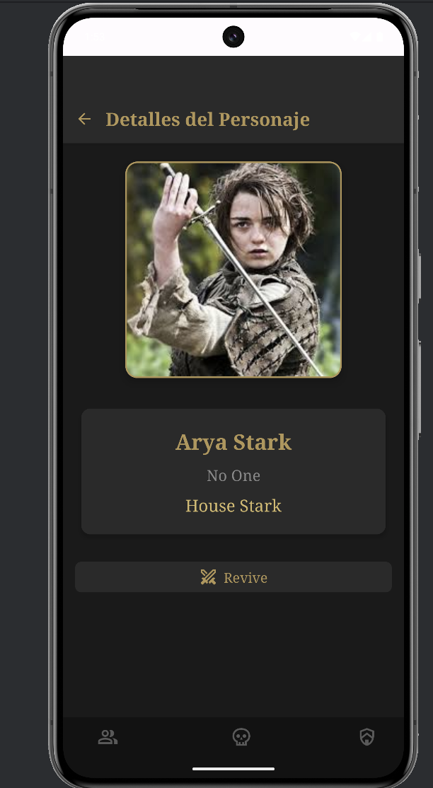 |

### Casas
| Lista de Casas | Detalle de Casa |
|----------------|-----------------|
| 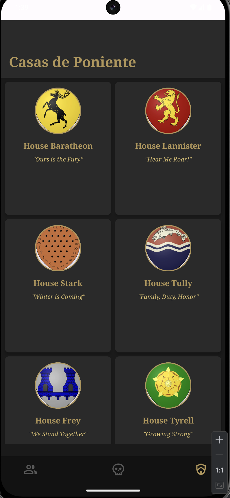 | 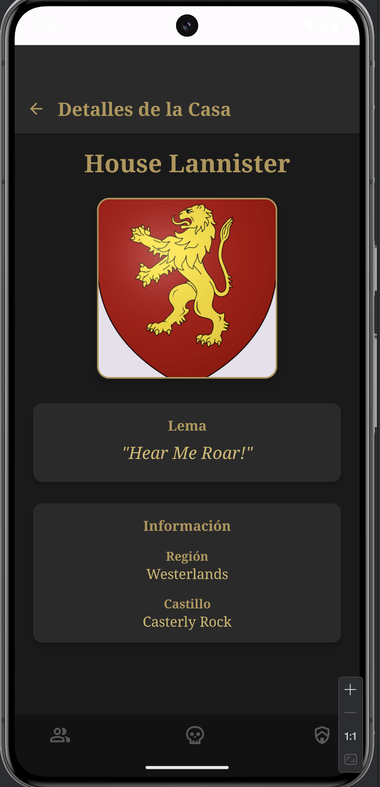 |

### Base de Datos
| Datos Almacenados Sin Muertes | Datos Almacenados Con Muertes  |
|---------------|-------------------|
| 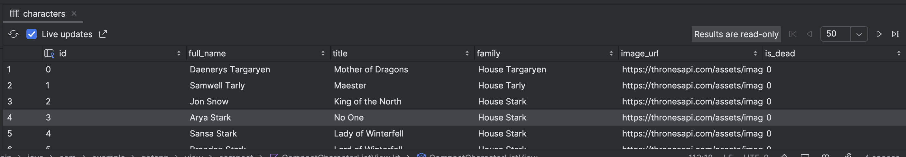 | 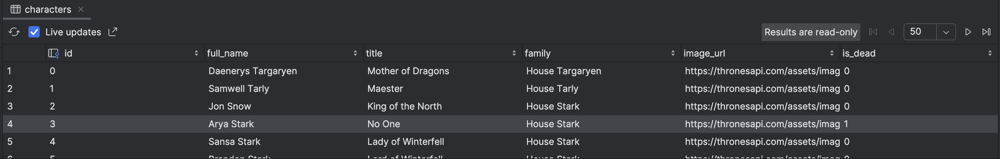 |

## Arquitectura

### MVVM (Model-View-ViewModel)
- **ViewModels:**
  - `APIViewModel`: Gestión de datos de personajes
  - `SearchViewModel`: Manejo de búsquedas
  - `HousesViewModel`: Gestión de casas

### Componentes Principales
- **Navigation:**
  - `NavGraph`: Gestión de navegación
  - `Routes`: Definición de rutas
  - `BottomNavItem`: Elementos de navegación

- **Views:**
  - Vistas adaptativas (Compact/Medium/Expanded)
  - Componentes reutilizables
  - Diseño consistente

- **Database:**
  - Room Database
  - DAOs
  - Entidades

## Tecnologías Utilizadas

- **Jetpack Compose:** UI toolkit moderno de Android
- **Room:** Persistencia de datos
- **Coroutines:** Programación asíncrona
- **Navigation Component:** Navegación entre pantallas
- **ViewModel:** Gestión del estado de la UI
- **LiveData:** Observación de datos
- **Glide:** Carga de imágenes

## Temas y Estilos

### Paleta de Colores
- **GotGold:** Color principal
- **GotDarkGray:** Fondos y elementos secundarios
- **GotBlack:** Fondo principal
- **GotLightGold:** Elementos de texto secundarios

## Instalación

1. Clonar el repositorio
```bash
git clone https://github.com/LSG-DAM2-M07-24-25/pr06-retrofit-yagoalonso_marcfernandez.git
```

2. Abrir el proyecto en Android Studio

3. Sincronizar el proyecto con Gradle

4. Ejecutar la aplicación

## Requisitos

- Android Studio Arctic Fox o superior
- Kotlin 1.5.0 o superior
- Android SDK mínimo: API 21
- Android SDK objetivo: API 33

## Contribución

1. Fork del repositorio
2. Crear una rama para tu feature
3. Commit de tus cambios
4. Push a la rama
5. Crear un Pull Request

## Contacto

@yagoalonso1 y @Marcausente en Github. 